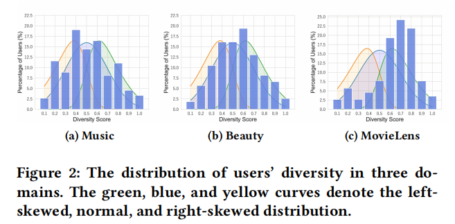
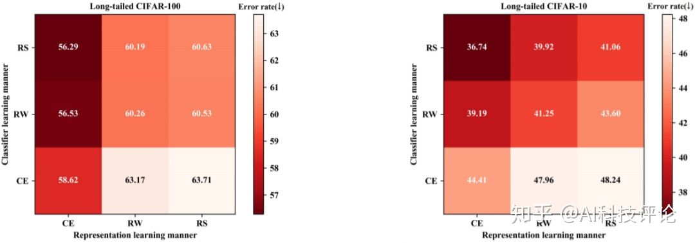
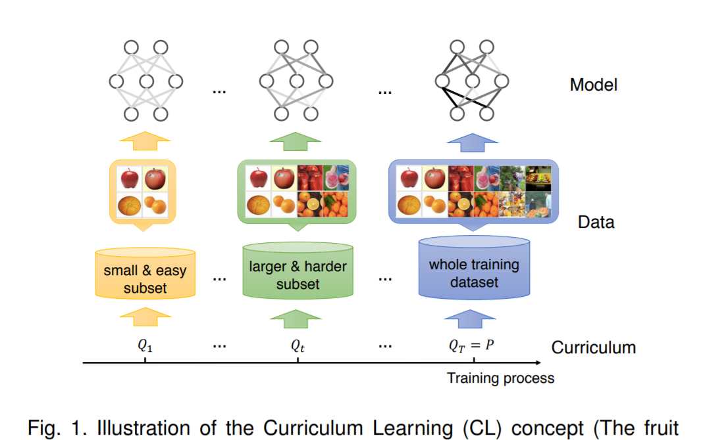

第一篇是阅读的论文，后篇是对前篇的不断解释

**Enhancing Domain-Level and User-Level Adaptivity in Diversified Recommendation**

BBN: Bilateral-Branch Network with Cumulative Learning for Long-Tailed Visual Recognition

A Survey on Curriculum Learning

---

第一篇是推荐领域的论文，任务是多样性推荐。

多样性推荐可以被视为双目标优化问题，即最大化推荐列表的整体相关性，并尽量减少列表中物品之间的相似性。一方面，推荐质量是通过推荐列表和真实列表之间的匹配分数来评估。另一方面，多样性是通过列表的类别覆盖范围（category coverage, CC）和列表内距离（intra-list distance, ild）来测量。

论文着重于在多样性推荐中增强领域级和用户级的自适应性，考虑了领域和用户在多样性偏好上的分布差异。

* 领域分布差异：大多数用户在选择电影类别时都有很大的变异性，而部分用户对音乐类型有相对固定的偏好，我们将其称为领域级别的多样性。
* 用户分布差异：即使在同一领域，每个用户也有自己的多样性偏好。例如，在 MovieLens 中，尽管大多数用户的多样性偏好都很大，但少量用户的多样性值很小，我们将其称为用户级别的多样性。

将领域级的多样性编码为一个广义的双向分支网络；其次我们为每个分支构建双向自适应度量学习的主干网络，进一步捕获用户级的多样性。

- 论文采用**视觉领域的双边分支网络**作为基本架构，两个独立分支的体系结构使模型具备**权衡准确率和多样性**的能力，而无需对参数进行调优；
- 论文进一步提出了一种**自适应平衡策略**，通过自动确定双边分支之间学习重点来编码领域级的多样性；
- 每个分支内设计了一个双向自适应度量学习骨干网络，用于捕获用户对特定物品的兴趣和物品对目标用户的定位，然后将用户级多样性作为连接用户与物品的特殊关系。

---

双分支网络（BBN）的基本思想起源于视觉识别任务，用于表示学习和分类器学习，以提高长尾数据的识别性能。直觉上，BBN 结构能够分离两个目标的优化过程，对应多样性推荐任务时，其中一个目标是准确性，另一个目标是多样性。

[CVPR 2020 Oral|双边分支网络BNN：攻坚长尾分布的现实世界任务](https://zhuanlan.zhihu.com/p/123899421)

---

Curriculum learning (CL) is a training strategy that trains a machine learning model **from easier data to harder data**, which imitates the meaningful learning order in human curricula.

[一篇综述带你全面了解 Curriculum Learning ](https://zhuanlan.zhihu.com/p/362351969)

